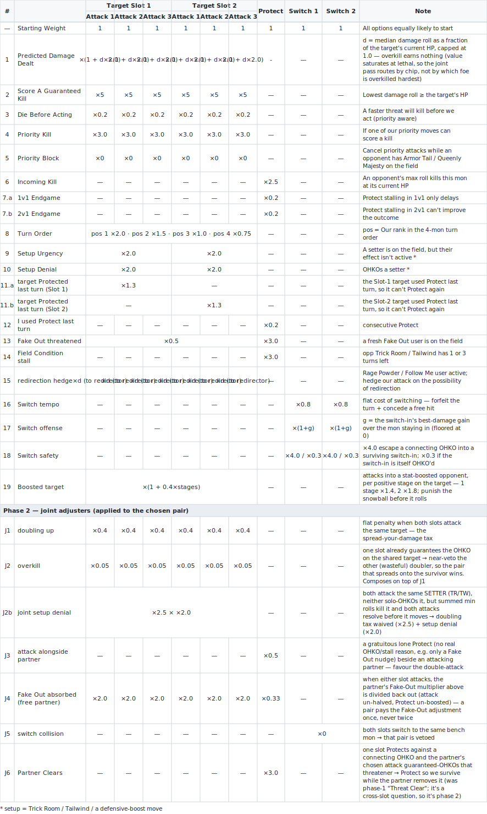

# WolfeyBot — How It Thinks

WolfeyBot plays Gen 9 VGC doubles (Champions / Reg M-B). This page explains how it
makes decisions, from the team-preview screen to choosing a move each turn. It is
the plain-language companion to the code in `team_preview.py` (preview) and
`decision/` (in-battle).

Three decisions are made:

1. **Which 4 to bring** (Part 1)
2. **Which 2 lead** (Part 2)
3. **What each active Pokémon does each turn** (Part 3)

---

## Part 1 — Team Preview: which 4 to bring

When the opponent's six Pokémon appear, the bot scores each of *our* six against
the whole enemy team with the **real damage engine** — the same calculator it
uses in battle — and brings the top four. (This replaced the old type-chart
approximation, deleted in 0.44.0: the engine sees actual stats, spreads, items,
and damage-reducing abilities, not just type multipliers, so Thick-Fat Venusaur,
a Multiscale Dragonite, and bulky EV spreads all register.)

Each of our mons is scored against each opponent — using the population-weighted
*assumed* forme / ability / item for the enemy — and averaged:

```
combined = offense × 2  +  defense × 1
```

- **Offense** — the best damage fraction our moveset deals to that opponent,
  capped at 1.0 (an OHKO maxes it), averaged over the six.
- **Defense** — `1 − the worst damage fraction they deal to us`, capped at 1.0
  (being OHKO'd zeroes it), averaged over the six.

So a mon that OHKOs several foes and survives their hits scores near the ceiling;
one that's walled or frail scores low.

**One mega per battle.** Each Mega-Stone holder is scored twice — as its mega and
as its base form. Selection is greedy; once a mega is claimed, any further stone
holder is valued at its *base* form (a second stone plays with a dead item), so
the bot never over-brings two megas. `select_mega` then designates the brought
stone holder whose **engine gain** (`mega_val − base_val`) is largest.

### Example

Opponent: Farigiraf / Incineroar / Sneasler / Kingambit / Talonflame / Pelipper.
The engine's actual matchup scores for the baseline roster (`mega/base`, scale
≈ 0–3):

| Our Pokémon | score | Brought? |
|---|---|---|
| Basculegion | **2.00** | ✓ |
| Garchomp | **1.95** | ✓ |
| Kingambit | **1.94** | ✓ |
| Aerodactyl | **1.77** | ✓ |
| Venusaur | 1.71 (base 1.32) | ✗ |
| Sneasler | 1.68 | ✗ |

The bring is matchup-specific, not a fixed "best six" — a different opponent
reshuffles these.

---

## Part 2 — Team Preview: which 2 lead

Two questions: **what will the opponent lead**, and **which of our four counter
that best**.

**Predicting the opponent's lead pair.** The bot records every opponent's turn-1
leads (`Battle Data/lead_stats.json`, rebuilt by `tools/build_lead_stats.py`).
It predicts not the two most common *individual* leads — which can be two
supports that are rarely brought together — but the **pair most often co-led**:
a Swampert + Pelipper duo seen together 51× beats pairing two unrelated
high-usage supports (`predict_pair`, co-occurrence-aware; falls back to
anchor + real-partner, then top-2 singles). The scorer actually **hedges** over
the top-3 likely pairs weighted by co-lead evidence (`predict_pairs`), so a lead
that's fine against the most-likely pair but folds to the second gets penalized
in proportion to how likely the second is.

**Scoring our lead pairs on the real board.** For each of our C(4,2) candidate
lead pairs, the bot builds an actual **turn-1 `BattleState`** against the
predicted opponent leads and runs the in-battle phase-1 scorer — so the same
real-damage, kill, turn-order, Fake-Out and doomed facts that pick moves also
pick leads. Each slot's value is its best attack weight; the pair's score is the
**product** of the two (one dead slot sinks the pair, geometric-mean-combined
across the hedged opponent pairs). Two penalties fire:

- **Doomed lead (×0.25)** — the board says this lead is KO'd before it acts (a
  frail mega led into a faster attacker); starting it just concedes the slot.
- **Self-refuting lead (×0.5)** — the engine's own best action for the lead is to
  *switch out*. If it doesn't want to be there, don't lead it.

TR/TW field variants are folded in when the predicted pair contains a setter.
Finally the score is multiplied by an **empirical pair prior** — our own
historical win rate with that exact lead pair (Beta-smoothed per team version) —
so a pairing the board loves but that has gone (say) 3-15 in practice is
discounted. The argmax pair leads; the other two keep their order.

---

## Part 3 — In-Battle Decisions

Each turn the engine works in **two phases**:

- **Phase 1** scores each possible action of each slot on its own (blind to the partner).
- **Phase 2** coordinates to pick the best joint pair of actions for the two slots.

**Actions carry their target.** A single-target move becomes one candidate per
live opponent — "Rock Tomb → foe A" and "Rock Tomb → foe B" are separate choices. Spread /
status / self moves, Protect, and switches are single candidates. Every candidate
starts at **weight 1.0**; modules **multiply** those weights. 

### The per-action weight table




*(Generated by `tools/gen_decision_table_svg.py` — edit the data there and re-run; rendered as SVG so it never horizontally scrolls on GitHub.)*


### Worked example (turn 1)

Our **Garchomp + Kingambit** vs **Incineroar + Basculegion**. Incineroar's Fake
Out will flinch one of ours, so phase 1 halves every attack (×0.5) and would
boost a Protect (×2).

**Phase 1 — each slot on its own.**

| Garchomp candidate (Choice Scarf, no Protect) | weight | | Kingambit candidate | weight |
|---|--:|---|---|--:|
| **Stomping Tantrum → Incineroar** | **3.13** (×2 Ground, Fake-Out-halved) | | **Kowtow Cleave → Basculegion** | **7.50** (guaranteed OHKO) |
| Dragon Claw → Basculegion | 2.57 | | Protect | 2.00 (Fake-Out-boosted) |
| Stomping Tantrum → Basculegion | 2.44 | | Low Kick → Incineroar | 0.91 |

Kingambit's Fake-Out-boosted **Protect (2.00)** is tempting in isolation, but its
Kowtow Cleave is a guaranteed OHKO (7.50), so even alone it prefers to swing.

**Phase 2 — the pair.** With both slots attacking, the **Fake-Out-absorbed**
adjuster frees the attack from its ×0.5 discount — a pair eats the flinch once,
not twice — so Kingambit's Kowtow Cleave jumps **7.50 → 15.00**. The chosen pair
is both attacking: Garchomp → Incineroar, Kingambit → Basculegion.

That's the design in one turn: per-slot scoring already prefers pressure here,
and the joint pass makes sure the pair only pays the Fake-Out tax once. (When a
slot's *isolated* best genuinely is a Fake-Out-boosted Protect with no real
shield reason, the **Coordination** adjuster instead halves it beside an
attacking partner — *don't gratuitously Protect while your partner swings.*)

### What the final weight means

| Final weight | In practice |
|---|---|
| 10 + | near-certain KO on a key target — almost never override |
| 4 – 10 | strong: guaranteed-KO range, or a Protect that shields a partner KO |
| 2 – 4 | clearly preferred — good damage, solid protective reason, or a clean escape-switch |
| 1 – 2 | baseline — fine, no standout reason |
| < 1 | discouraged — a better option exists |
| 0 | hard veto — never chosen |
